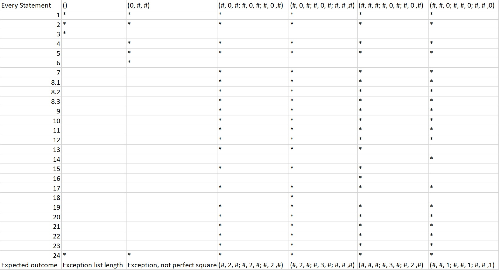
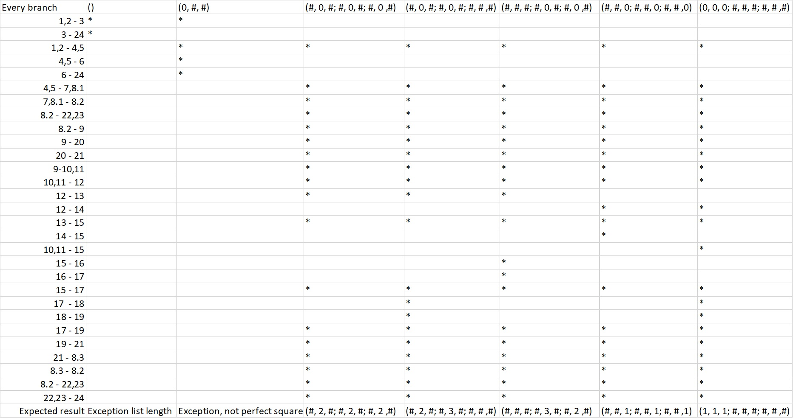

# Борјан Гаговски, 196025

2. 

3.
Цикломатскaта комплексност изнесува 8. Го пресметав со тоа што изборјав колку региони има на графот - бројот на региони и цикломатската комплексност важи да се исти за сите Control Flow Graphs.

4.

Идејата со тоа како ги одбрав различните тест случаи ми беше да имам посебен тест случај каде што колку се може се „изолираат“ сите клучни statements каде се менува вредноста на променливата num (13, 14, 16, 18). Згора на тоа, додадов и  посебни тест случаи за да помине секој исклучок, секако.

5.

За Every Branch методот, со иста логика како за Every Statement, ги искористив истите тест случаи. Единствената гранка која остана непомината со тие тест случаи беше таа од 10,11 да скокне на 15 -- односно кога ниедна од нулите нема „бомба“ од лево или од десно и директно проверува дали има бомба над или под таа нула.. Откако додадов тест случај кој ја покри таа гранка, ги имав поминато сите гранки.
